# TODO앱이 왜 필요한데?
## 두뇌를 믿으시나요?

우선 저는 못 믿습니다. 어제 무엇을 먹었는지도 가물가물한데 
오늘 해야 할 많은 일을 완벽하게 기억하기는 불가능합니다.

에너지 소모도 엄청나죠.
투두 리스트를 쓰기 전에는 
일을 끝낼 때마다,
심지어 일을 하면서도 '이따 뭐하려고 했지...?' 생각을 했습니다.

일에 방해가 되고 기 빨리는 일이죠!!
## 시간 관리와 생산성

투두 리스트를 사용하면 생각하는 데 에너지를 소모할 필요가 없습니다.

매일 오전 투두 리스트를 정리하고, 일을 시작합니다.
하나의 일이 끝나면 오전에 정리한 투두 리스트를 보고 다음 일을 진행합니다.

'뭘 해야 할까~?' 생각할 필요도 없습니다.
Alt + Tap만 '딸깍' 눌러주면 다음 일을 바로 알 수 있죠.

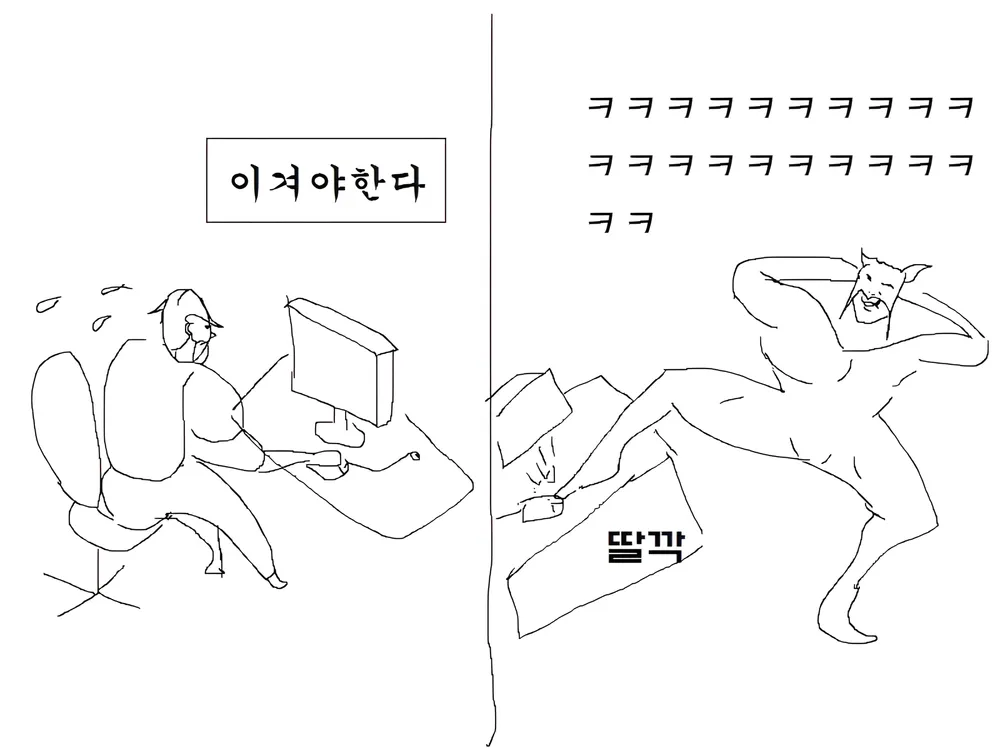

일을 하다가, '앗 이것도 해야 해!' 라고 생각이 든다면요?
다시 한번 '딸깍' 누르고 해야 할 일을 적으면 되죠!!

기억할 필요도, 억지로 기억 속을 헤집을 필요도 없습니다.
# 투두 앱 표류기

그러나 딱 맞는 앱을 찾는 건 생각보다 어려운 일입니다.
제가 사용해 본 다른 앱들을 함께 보시죠.
## Notion

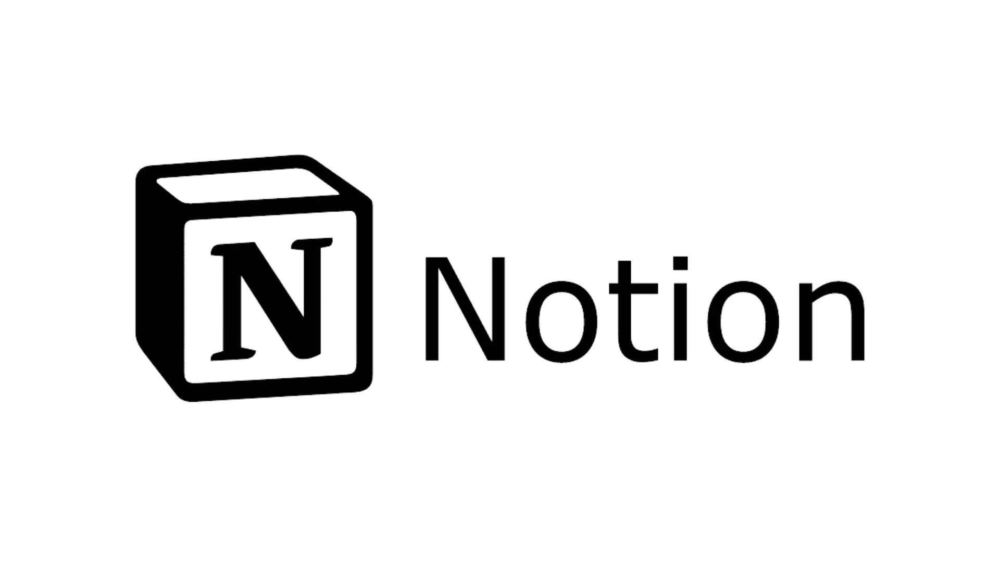

첫 번째는 노션입니다.
노션은 훌륭한 메모 앱이죠.

그렇지만 투두 리스트로써는 별로입니다.

노션은 느립니다.
공감하실지 모르겠지만 노션은 상당히 무겁습니다.

할 일 목록을 보려는데, 로딩이 3초 이상 걸립니다.
인내의 3초를 견디고 열린 페이지가 다른 페이지라면?
상당히 화나죠.

이런 자잘한 스트레스 때문에 투두 리스트로는 탈락이었습니다.

장점 : 메모 앱으로서는 100점
단점 : 투두 리스트로서는 무거운 앱, 로딩이 느림

추천 : 자동 저장, 동기화, 모든 플랫폼 사용 가능, 높은 자유도를 가진 노트 앱을 찾는 분들에게 추천!!!
## Microsoft Todo

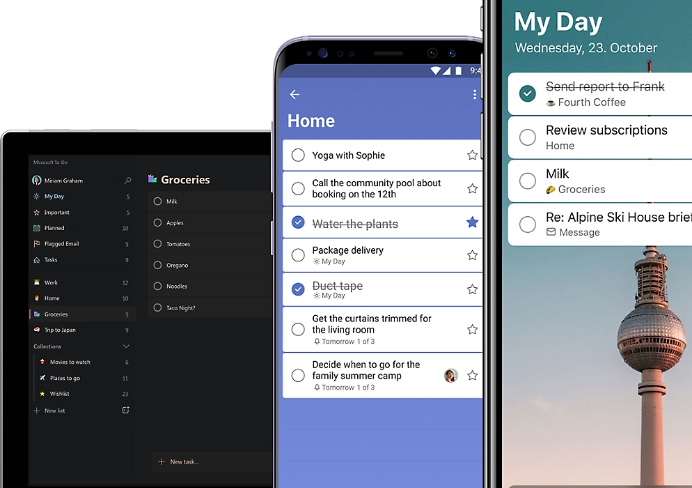

Microsoft Todo는 심플합니다. 담백한 사골 같습니다.

노션 이후에는 간단한 투두 리스트를 찾아 헤맸습니다.
그때 발견한 게 이것이죠.

여러 가지 카테고리를 정해서 투두 리스트를 분류할 수 있습니다.

그러나, 우선순위를 1단계 밖에 지정할 수 없습니다.
이 부분은 상당히 아쉽죠.

기본에 충실하고 빠른 앱입니다.
오래 잘 사용했던 앱이죠.

투두 리스트를 처음 사용하시는 분들, 간단하고 가벼운 앱을 찾으신다면 추천합니다!!

장점 : 간단한 UI/UX, 모든 플랫폼에서 사용 가능
단점 : 기능이 부족함, 심플한 디자인이 지겨워질 수 있음

추천 : 투두 리스트 입문자 분들에게 추천!!
## 애플, 미리 알림(Reminder)

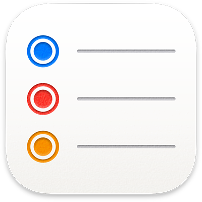

존재조차 모르는 분들이 꽤 있더라구요...!! (본인도 잘 몰랐음...)

이 앱도 간단하고 가볍게 사용할 수 있습니다.
애플 생태계가 익숙한 사람이라면 추천합니다!!

최근 업데이트로 인해 칸반 보드 형태도 사용할 수 있고,
여러 가지 카테고리로 나눠서 사용할 수도 있습니다.

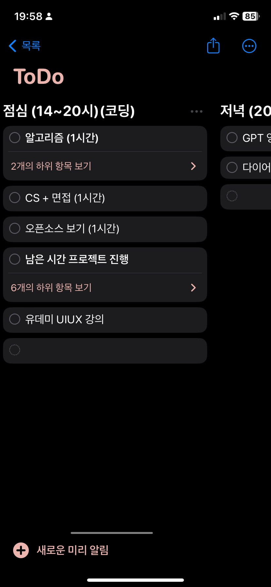
(칸반 보드의 예시)

투두 리스트로서 기능에 부족함이 없습니다.
게다가 알림 기능이 특히 좋습니다!!

위치 기반 알림이 가능합니다.
특정 위치에서 500m 멀어지면 알림이 온다던가,
집에 거의 다 왔을 때 알람이 오게 할 수 있습니다.

관련 내용은 [유튜브, 잇츠 오케이](https://www.youtube.com/watch?v=sLfGSq9Cz3M) 채널에 잘 정리되어 있으니 확인해보세요!!

장점 : 애플의 미친 연동성, 장소에 따른 알림, 최근 업데이트로 다양한 기능 지원
단점 : 애플 생태계, 기능이 조금 아쉬움

추천 : 간단한 투두 리스트를 찾는 아이폰, 맥 유저들
## 기타 다른 앱들...

- Todoist : UI가 마음에 안 들어서 바로 삭제했었습니다.
- OmniFocus, Things : 가격도 비싸고, 기능이 너무 많아 보였습니다.
## 드디어 만난, TickTick

지금은 TickTick에 정착했습니다.
한 달 정도 사용하고 있죠!!

TickTick을 사용해 보고 싶은 분들이나,
투두 리스트를 고민하는 분들이라면 잘 찾아오셨습니다.

한번 보고 가세요!!
# TickTick과의 첫 만남
## 지원하는 플랫폼

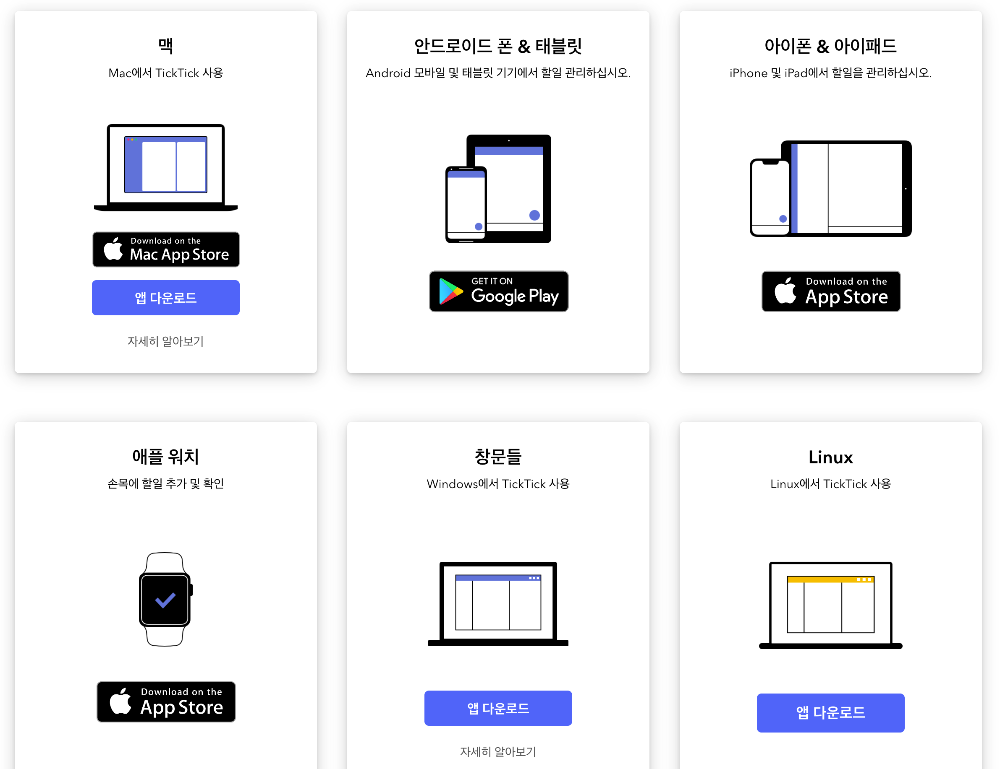

TickTick의 장점 중 하나죠!
다양한 플랫폼에서 사용할 수 있습니다.

핸드폰과 태블릿, 맥OS, Windows 모두 사용할 수 있습니다.
## 가격

무료로도 사용할 수 있지만, 몇 가지 기능이 제한됩니다.
저는 무료로도 전혀 불편함이 없어, 무료로 사용 중입니다.

만약, 프리미엄 결제를 원하신다면 가격은 아래와 같습니다.

연간 $35.99 (2024년 5월 21일 기준 ₩49,054)
달에 $3 미만 (₩4,089 미만)
## 무료로도 차고 넘치는 기능

제가 무료로 사용하는 데에는 이유가 있죠!!
돈을 안내도 다양한 기능을 사용할 수 있습니다.
###  "TODO" 그리고 "마크다운"

Todo를 적고, 날짜, 반복, 카테고리 등 간단한 기능들은 당연히 있습니다!!

게다가 마크다운을 지원합니다!
무료 투두 리스트 앱에서 마크다운 메모 지원은 처음 봤습니다.
너무 유용하고 좋아하는 기능 중 하나입니다!!
### "우선순위" 그리고 "아이젠하워 매트릭스"

이 기능들도 주목해야하는데요!!

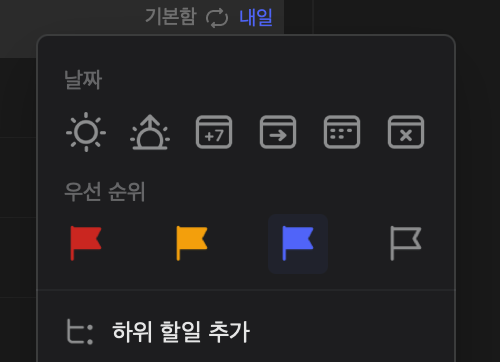

우선순위를 4단계로 나눠서 정할 수 있습니다.

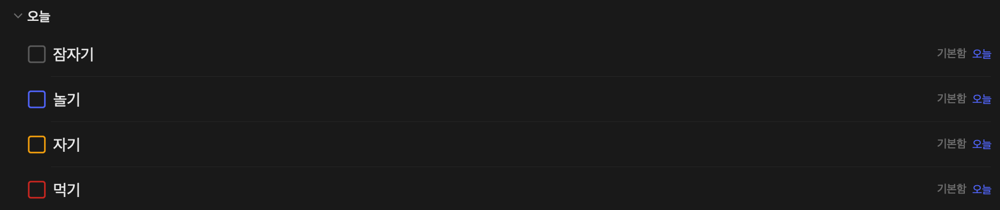

위처럼 우선순위를 한눈에 알아볼 수 있습니다.

게다가 아이젠하워 매트릭스를 사용할 수 있는데요.
아이젠하워 매트릭스를 간단하게 설명해 보자면, 
할 일을 4가지 종류로 분류하고 일의 중요도를 파악하는 방법론입니다.

관련해서 좋은 글이 있어 [링크](https://brunch.co.kr/@fastfive/276)로 남겨두겠습니다.
### 생산성을 위한 "뽀모도로"

생산성에 관심이 있는 분이라면 이미 알고 있을 도구입니다.

간단하게 설명하자면, 뽀모도로는 업무 생산성 향상을 위한 시간 관리 방법입니다.
25분 집중 후 5분 휴식을 반복하고 4번을 반복하면 15~30분간 휴식을 하죠.

기본적인 룰만 설명을 했고, 자세한 내용은 추후에 글로 남겨보겠습니다.

TickTick에는 뽀모도로가 내장되어 있습니다.
각 할 일을 뽀모도로를 설정해 더욱 밀도 있게 할 수 있죠!!

글을 쓰는 지금도 25분짜리 뽀모도로를 이용하고 있습니다.

맥OS를 사용한다면 상단바에서 타이머가 보이기에 효율적으로 활용할 수 있습니다.
윈도우는 잘 모르겠습니다...
### 최대 5개, "해빗 트래커"

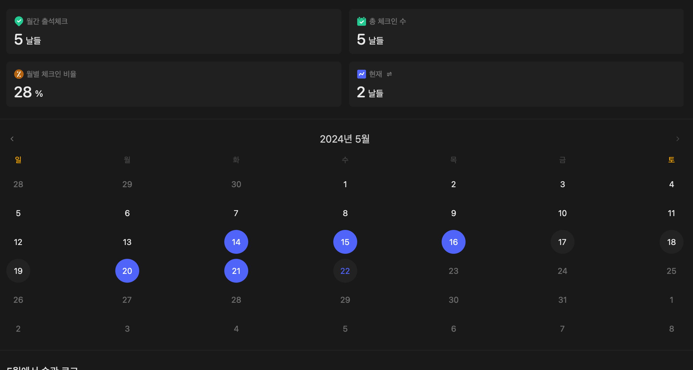

해빗 트래커는 습관이나 루틴을 기록하고 추적하기 위한 도구입니다.
TickTick은 무료 버전에서 5개까지 습관/루틴을 기록할 수 있습니다.

저는 조금 적다고 느꼈지만, 잘 사용하고 있는 기능입니다.
### 극한의 J를 위한 "통계"

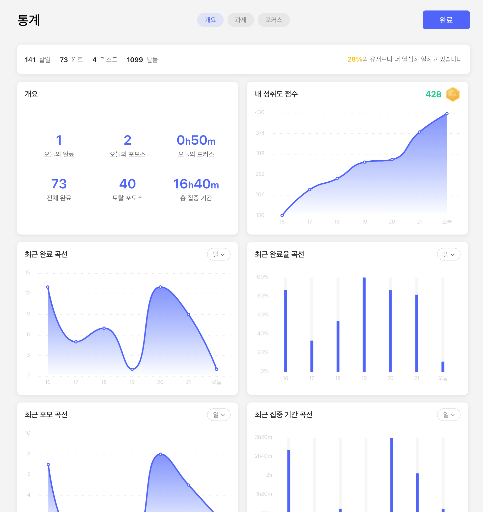

자신의 생산성을 시각화해서 볼 수 있습니다.
이런 걸 좋아하는 사람들은 환장할 기능이죠!!

그게 저였습니다.

무료 버전에서 이 정도의 퀄리티라니, 놀랍습니다...
### 회고를 위한 "요약"

이 앱을 사용하는 큰 이유들 중 하나입니다.

저는 매일 일기를 쓰고 있습니다.
디지털로 작성하고 있기 때문에, 이 "요약" 기능을 유용하게 사용하고 있죠.

이 기능은 특정 기간 동안의 할 일들을 요약해 주는 기능입니다.

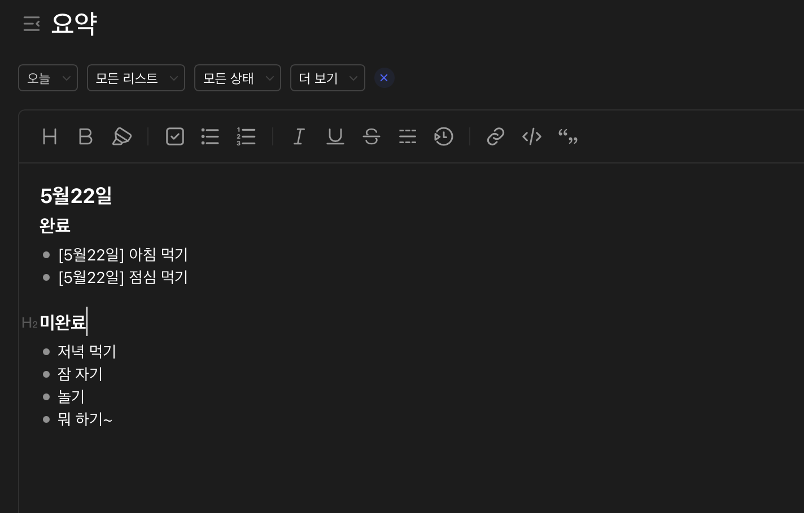

매일 밤 일기를 쓸 때, "요약"을 복사해서 사용합니다.

그럼 일기를 편하게 쓸 수 있기도 하고,
나중에 다시 일기를 볼 때 그날 무엇을 했는지 알기 쉬워지죠!!

일기의 효율이 약 50% 정도 오르는 느낌입니다.
# 이런 분들에게 추천합니다.

- 생산성 툴 고인물들
	- 이미 많은 생산성 툴을 사용한다면, 위 기능 중 겹치는 게 있을 겁니다.
	- 겹치는 기능을 TickTick으로 뭉친다면, 관리도 편하고 통계까지 제공됩니다.

만약 많은 기능이 필요 없고, 복잡하다면 위에서 언급한 가벼운 툴을 추천합니다.

- IOS 미리알림
- Microsoft Todo

오늘은 요즘 정착한 투두 리스트인 TickTick에 대해 설명해 봤습니다.
쓰다 보니 추가로 해야 할 이야기들이 생각이 나네요.

뽀모도로 테크닉, 회고의 중요성 등 다른 이야기는 시간이 생기면 다시 써보겠습니다.
오늘은 여기까지 하겠습니다. 이만!!