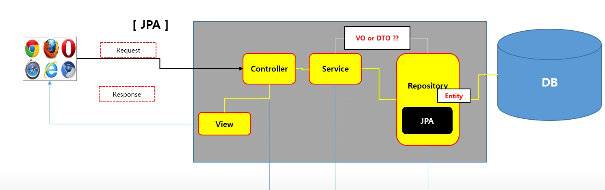

이번에 회사에서 Spring Boot, JPA, Thymeleaf를 사용하는 프로젝트에 투입되었습니다.
프론트엔드 개발자도 전체적인 구조를 알고 있으면, 파일 구조를 보거나 소통할 때 훨씬 수월할 것으로 기대합니다.

여태 공부한 내용을 간단하게 공유합니다.

[유튜브, IT 늦공 김부장](https://www.youtube.com/watch?v=vBeOAKIjJvs&list=PL3036mp45iYyY_OnS2THlO7uqPsJK_Kh2&index=7)

위 그림은 Spring Boot, Thymeleaf, JPA를 사용한 웹앱의 구조입니다.
이 구조를 이해하기 앞서 MVC 패턴에 대해 이야기할 필요가 있습니다.

MVC 패턴에 Service 계층을 추가한 구조가 바로 위 구조이기 때문이죠.
## MVC 패턴

> MVC는 UI, 비즈니스 로직, 데이터 이 세 가지 구성 요소를 분리하여 각 요소가 서로에게 미치는 영향을 최소화하기 위한 디자인 패턴입니다.

- Model : 데이터와 비즈니스 모델을 포함합니다. DB와 상호작용, 데이터 처리 및 검증을 처리합니다. **(데이터 처리)**
- View : 사용자에게 화면을 보여줍니다. UI와 데이터 표현을 담당하며 사용자의 요청에 따라 정보를 처리합니다. **(입력과 출력)**
- Controller : 사용자의 입력을 받아 처리하고, 적절한 응답을 생성하기 위해 모델과 뷰를 조정합니다. **(요구사항 처리)**
### MVC 패턴의 장점

1. 관심사의 분리
	1. UI, 비즈니스 로직, 데이터의 분리로 인해 개발과 유지보수를 편하게 만들어줍니다.
2. 유연성
	1. 관심사가 분리되어 있으니, 애플리케이션의 일부를 수정, 추가하기가 쉽습니다.
3. 재사용성

그러나, 간단한 프로젝트에서는 복잡성만 증가하는 상황이 될 수 있습니다.

간단하게만 알아보고, 바로 구조를 살펴보겠습니다.
##  MVC 패턴으로 살펴보는 애플리케이션 구조

### Model 영역

위에서 Model은 DB와 상호작용을 한다고 말했습니다.
데이터를 직접 처리하는 영역이죠.

DB와 가장 가까이 있으면서, 처리를 도와주는 도구는 무엇일까요?

바로 JPA입니다.

JPA는 자바에서 객체를 DB에 저장하고 관리하기 위한 API입니다.
JPA를 사용하면 데이터베이스의 CRUD(Create, Read, Update, Delete) 작업을 더 편하게 처리할 수 있습니다.

조금 더 들어가 보겠습니다.
JPA에서 Entity(엔티티)와 Repository(리포지토리)이 두 가지의 역할을 살펴보면 좋겠네요.

엔티티는 Java에서 사용할 수 있도록 DB의 스키마 혹은 타입이라고 하는 것을 정의합니다.
(자세한 내용은 다르나, 이해를 위해 이렇게 썼습니다.)
이를 통해, 엔티티 클래스의 필드(변수)는 테이블의 컬럼(열)에 매핑이 되고,
각 필드의 타입은 데이터베이스 컬럼의 데이터 타입과 대응되게 됩니다.

리포지토리는 엔티티에 대한 CRUD 작업을 수행합니다.
DB와 상호작용하는 역할을 맡고있죠.
### Service 영역

MVC 패턴에서는 없었던 계층이 추가됬습니다.
Service 영역인데요.
이곳은 Controller 영역과 Model 영역 사이에 위치하여, 
*비즈니스 로직*을 처리하는 영역입니다.

기존 MVC 패턴에서는 컨트롤러 영역이 비대해지는 문제가 있었습니다.
비즈니스 로직이 분리가 모두 컨트롤러 영역에 섞여버렸기 때문이죠.

덕분에, 유지보수와 재사용성이 떨어지고, 테스트가 어려워지는 문제들이 있었습니다.

하지만 Service 영역을 나눠 비즈니스 로직을 전부 처리하면서,
관심사 분리가 용이해졌습니다.
### Controller 영역

컨트롤러 계층에서는 이전에도 봤듯 Model과 View 사이에서 둘을 연결하는 역할을 수행합니다.

View의 요청을 받고, 요청을 검증하며, 응답을 반환합니다.
또, 비즈니스 로직을 처리하기 위해 서비스 계층의 메서드를 호출하기도 하죠.
### View 영역

View 계층에서는 사용자에게 화면을 보여주고, 사용자에 요청을 Controller에게 보냅니다.

이를 위해서 Thymeleaf를 사용합니다.

> Thymeleaf는 Java 기반의 서버 사이드 템플릿 엔진으로 주로 Spring 프레임워크와 함께 사용합니다.

한 문장으로 Thymeleaf를 간단히 정의해 봤는데요.

'서버 사이드 템플릿 엔진'은 조금 어려운 말일 수 있겠습니다.
두 가지 개념이 섞여 더 어렵게 느껴질 수 있습니다.

"서버 사이드", "템플릿 엔진" 이 두 가지 개념을 이해하면 쉬울 겁니다.

우선 템플릿 엔진이란, 지정된 템플릿 양식과 데이터가 합쳐져 동적으로 HTML(과 같은) 문서를 출력해 주는 도구입니다. 덕분에 우리는 사용자 요청에 따라 동적으로 HTML을 보여줄 수 있죠.

다음으로 "서버 사이드"란 말 그대로 "서버"단에서 HTML(과 같은) 문서를 생성해서 클라이언트(브라우저)에게 전송한다는 의미입니다.

결국 "서버 사이드 템플릿 엔진"이라는 단어는 "사용자의 요청에 따라 동적으로 HTML을 쉽게 서버단에서 생성해서 브라우저에 전송할 수 있게 도와주는 도구"라고 보시면 되겠습니다.

아마 프론트엔드 개발자라면, SSR(서버 사이드 렌더링)이나 CSR(클라이언트 사이드 렌더링)이라는 말이 조금 더 익숙할 것 같습니다.
### 그럼 Spring은...?

스프링은 이 모든 계층에서 중요한 역할을 수행합니다.
각 계층 간 결합도를 낮추고, 유지 보수성을 높이는 데 기여하죠.
## 결론

신입 프론트엔드 개발자의 관점으로 처음 스프링 프로젝트를 봤을 때는 상당히 머리가 복잡했습니다.
여태 React만 공부해오고, 서버나 DB와 관련한 코드는 전혀 몰랐으니 말이죠.
그러나 이렇게 구조를 먼저 파악하는 노력을 통해 조금 더 쉽게 소통하고 이해하는 계기가 되었으면 합니다.
내일부터 바로 오늘 이해한 내용을 중심으로 소통해 볼 생각입니다...!

최대한 이해하기 쉽고 보기 쉽도록 어려운 어휘를 피해 썼습니다.
그래서 오류가 있을 수 있고, 불필요하게 많이 쓴 부분이 있을 수 있습니다.

보면서 오류가 있다면, 댓글로 피드백 부탁드립니다.

모든 신입 개발자분들 파이팅입니다~!!
## 참고 문서

https://velog.io/@hwsa1004/Java-MVC-%ED%8C%A8%ED%84%B4

https://www.youtube.com/watch?v=vBeOAKIjJvs&list=PL3036mp45iYyY_OnS2THlO7uqPsJK_Kh2&index=7

https://ccomccomhan.tistory.com/131