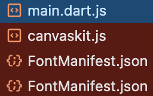
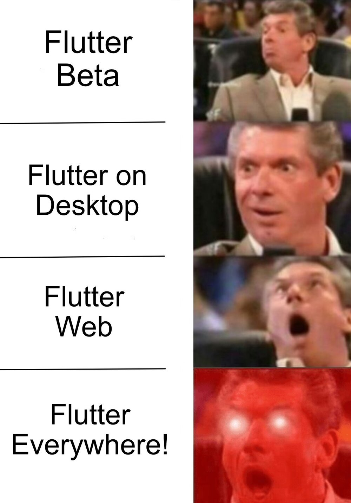

플러터(Flutter)는 모바일, 데스크톱, 그리고 웹 애플리케이션을 단일 코드 베이스로 개발할 수 있게 해주는 강력한 프레임워크입니다.

일반적으로 플러터를 사용한다면, 앱을 만들기 위해서겠죠.

하지만 어쩔 수 없이 플러터로 웹을 만들어야 하는 경우가 있습니다.



플러터 웹은 쉽지 않습니다.
개발 자체는 어렵지 않을 수 있지만,
성능이나 SEO, 브라우저 호환 등 여러 방면에서 문제가 많습니다.

저는 이 중에 성능에 관해 호기심이 생겨
한번 파봤습니다.
## 성능 개선

성능을 개선하려면 우선 성능을 "*측정*" 할 수 있어야 합니다.

일반적으로 웹에서 성능 측정은 [Lighthouse](https://developer.chrome.com/docs/lighthouse/overview?hl=ko)를 이용합니다.

Lighthouse는 구글에서 개발한 오픈소스 자동화 도구로, *웹 페이지의 품질을 개선하는 데 사용*합니다. 성능, 접근성, PWA, SEO 등 다양한 측면에서 웹사이트를 간단하게 분석합니다. 

문제는 플러터로 만든 웹은 Lighthouse로 측정이 어렵습니다.
일반적인 DOM 구조가 아닌, Canvas에 UI를 그리는 형태이기 때문이죠.

1. 초기 로딩 시간 측정의 부정확함 : Lighthouse는 일반적으로 HTML의 초기 로딩을 기준으로 성능을 측정합니다. 하지만 *플러터 웹은 UI가 Canvas로 그려지기 때문에 측정이 부정확합니다.*
2. DOM 구조 분석의 한계: 플러터는 캔버스 기반 렌더링을 사용합니다. 때문에 *Lighthouse가 일반적인 DOM 구조를 분석하는 방식으로는 페이지의 구조를 파악하기 어렵습니다.*
3. 최적화 제안의 적절성: Lighthouse가 제공하는 최적화 제안이 플러터 웹 구조에 적합하지 않습니다.

이런 문제 때문에, 플러터 웹 성능을 측정하기 위해 대안 방법을 찾아야하죠.

그리고 제가 생각하는 가장 직관적인 방법은 **JS 번들 크기를 줄이는 것** 입니다.
## 웹 바이탈: 웹 성능의 표준

웹 바이탈(Web Vitals)은 구글에서 제시한 웹 사이트 성능 측정을 위한 핵심 지표입니다.
이 지표는 사용자 경험의 핵심 요소를 측정하는 데 중점을 두고 있습니다.

주요 웹 바이탈 지표는 아래와 같습니다.

1. **Largest Contentful Paint (LCP)**: 메인 콘텐츠가 얼마나 빠르게 렌더링 되는지를 측정합니다.
2. **Interaction to Next Paint (INP)**: 사용자의 첫 상호작용에 얼마나 빠르게 반응하는지를 나타냅니다.
3. **Cumulative Layout Shift (CLS)**: 페이지 레이아웃의 안정성을 측정합니다. 즉, 렌더링 후에 콘텐츠가 얼마나 이동하는지를 나타냅니다.

이러한 지표들을 종합해 보면, 웹 성능에서 가장 중요한 두 가지 요소는 *초기 로딩 속도*와 *시각적 안정성*임을 알 수 있습니다. 그중에서도 사용자 경험에 가장 직접적인 영향을 미치는 것은 초기 로딩 속도입니다.

플러터로 개발된 웹 애플리케이션의 경우, 이러한 성능 지표를 개선하는 것이 일반적인 웹 개발보다 더 까다로울 수 있습니다. 그러나 몇 가지 전략을 통해 성능을 향상시킬 수 있습니다.
## 플러터 웹 성능 개선: JS 번들 크기 줄이기

플러터 웹 애플리케이션의 초기 로딩 속도는 주로 JavaScript 번들 크기에 의해 결정됩니다.
웹 페이지에 처음 접속하면, HTML을 받게 되고 이 HTML 내의 script 태그를 통해 `main.dart.js`를 포함한 여러 JS 파일들이 로드됩니다.



이 중에서 우리가 직접적으로 제어할 수 있는 부분은 `main.dart.js` 파일입니다. 이 파일의 크기를 최소화함으로써 초기 로드 시간을 크게 개선할 수 있습니다. Dart 컴파일러는 이를 위해 두 가지 주요 기능을 제공합니다.

1. 트리 쉐이킹 (Tree Shaking)
2. 지연 로딩 (Lazy Loading)
### 트리 쉐이킹

트리 쉐이킹은 컴파일 과정에서 사용되지 않는 코드를 자동으로 제거하여 최종 JavaScript 번들의 크기를 줄이는 기술입니다. 이는 Dart 컴파일러에 내장되어 있어 별도의 설정 없이도 기본적으로 동작합니다.

컴파일만 하면, 저희가 건드릴 부분은 전혀 없죠!!
### 지연 로딩

지연 로딩은 애플리케이션의 모든 코드를 한 번에 로드하지 않고, 필요한 시점에 필요한 부분만 로드하는 기술입니다. 
플러터에서는 `deferred as` 키워드를 사용하여 이를 구현할 수 있죠.

```dart
import 'heavy_widget.dart' deferred as heavy;

class MyWidget extends StatelessWidget {
  Future<void> loadLibrary() async {
    await heavy.loadLibrary();
  }
  
  @override
  Widget build(BuildContext context) {
    return FutureBuilder(
      future: loadLibrary(),
      builder: (context, snapshot) {
        if (snapshot.connectionState == ConnectionState.done) {
          return heavy.HeavyWidget();
        }
        return CircularProgressIndicator();
      },
    );
  }
}
```

이 예제에서 `deferred as` 키워드를 사용하여 `heavy_widget.dart` 파일의 로딩을 지연시키고 있습니다. 이 위젯이 실제로 필요한 시점에 `loadLibrary()` 메서드를 호출하여 로드합니다. 이러한 방식으로 초기 번들 크기를 줄이고, 필요한 시점에 필요한 코드만 로드함으로써 초기 로딩 시간을 개선할 수 있습니다.

지연 로딩을 효과적으로 사용하려면, 애플리케이션의 구조를 잘 이해하고 자주 사용되지 않는 큰 모듈이나 페이지를 식별하는 것이 중요합니다. 이러한 부분들을 지연 로딩으로 처리하면 초기 로딩 시간을 크게 줄일 수 있습니다.

이러한 최적화 기법들을 적용함으로써, 플러터 웹 애플리케이션의 성능을 상당히 개선할 수 있습니다.
그러나, 성능이나 SEO등 여러 부분을 생각한다면 플러터로 웹을 만든다는 것은 아직은 어려운 일이 될 수 있을 것 같습니다.