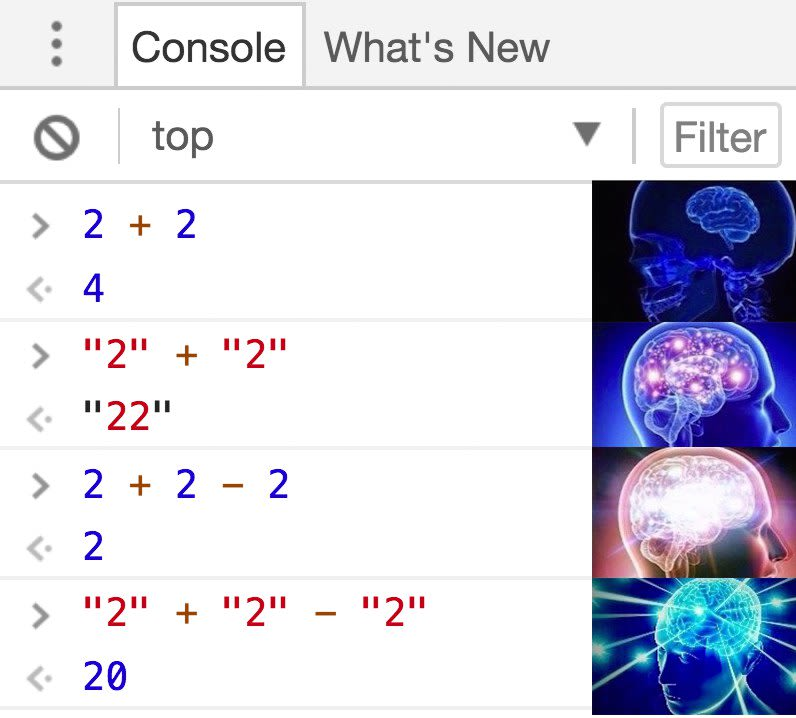

> 이 글은 ["쏙쏙 들어오는 함수형 코딩"](https://product.kyobobook.co.kr/detail/S000001952246)을 읽고 썼습니다.




여러분이 웹 프론트엔드 개발자라면 아마 자바스크립트를 사용할 것 입니다.
그리고 자바스크립트는 객체지향과 함수형 프로그래밍을 모두 지원하는 언어입니다.

게다가 React를 한다면, 함수형 프로그래밍을 배울 이유는 충분하다고 생각합니다.
(함수형 컴포넌트를 사용한다면) 아마 Class와 객체보다는 함수를 더 많이 사용할 테니 말이죠.

그렇다면 우선, 함수형 프로그래밍이 무엇인지 알아봐야겠죠?
## 함수형 프로그래밍

함수형 프로그래밍은 그 정의가 모호합니다. 아래는 위키피디아의 정의입니다.

> **함수형 프로그래밍**(函數型 프로그래밍, [영어](https://ko.wikipedia.org/wiki/%EC%98%81%EC%96%B4 "영어"): functional programming)은 자료 처리를 [수학적 함수](https://ko.wikipedia.org/wiki/%ED%95%A8%EC%88%98 "함수")의 계산으로 취급하고 상태와 가변 데이터를 멀리하는 [프로그래밍 패러다임](https://ko.wikipedia.org/wiki/%ED%94%84%EB%A1%9C%EA%B7%B8%EB%9E%98%EB%B0%8D_%ED%8C%A8%EB%9F%AC%EB%8B%A4%EC%9E%84 "프로그래밍 패러다임")의 하나이다
> 출처 : [위키피디아 함수형 프로그래밍](https://ko.wikipedia.org/wiki/%ED%95%A8%EC%88%98%ED%98%95_%ED%94%84%EB%A1%9C%EA%B7%B8%EB%9E%98%EB%B0%8D)

이를 간단하게 정리해 보자면 아래와 같습니다.

함수형 프로그래밍은

1. 자료 처리를 `계산`으로 취급하고
2. `가변 데이터`를 멀리하는
3. 프로그래밍 패러다임의 하나이다.

무슨 소리인지 전혀 모르겠습니다…!!
하나씩 알아보기 위해 저희는 "`데이터`, `계산`, `액션`"이라는 함수형 프로그래밍의 기본부터 알아야 합니다.
### 데이터

**데이터**는 어떤 사실 그 자체입니다.
우리가 자주 만드는 Todo list를 예시로 들어보자면,

사용자가 입력한 Todo는 *데이터*라고 볼 수 있죠.
그리고 그것을 저장하는 todoList라는 배열도 *데이터*라고 볼 수 있겠네요.

아래 코드는 GPT 에게 요청한 간단한 todolist 입니다.

```ts
import React, { useState } from 'react';

function TodoList() {
  // 할 일 목록 배열과 사용자 입력값을 저장하는 상태
  const [todoList, setTodoList] = useState([]);
  const [inputValue, setInputValue] = useState('');

  // 사용자가 입력한 값을 할 일 목록에 추가하는 함수
  const addTodo = () => {
    if (inputValue.trim()) {
      setTodoList([...todoList, inputValue]);
      setInputValue(''); // 입력값 초기화
    }
  };

  return (
    <div>
      <h1>To-Do List</h1>
      <input
        type="text"
        value={inputValue}
        onChange={(e) => setInputValue(e.target.value)}
        placeholder="Enter a task..."
      />
      <button onClick={addTodo}>Add Task</button>

      <ul>
        {todoList.map((task, index) => (
          <li key={index}>{task}</li>
        ))}
      </ul>
    </div>
  );
}

export default TodoList;
```

이 코드에서 `todoList`라는 todo를 담는 배열과,
사용자 입력을 담는 변수 `inputValue`는 데이터입니다.
### 계산과 액션... 그 전에 순수 함수란?

계산과 액션을 알아보기 전에, 저희는 `순수함수`에 대해서 알아보겠습니다.
**계산**과 **액션**을 구분하기 위해 알아야 할 중요한 개념이기 때문이죠.

- 순수 함수
	- 순수 함수란, `부수 효과`가 없는 함수입니다.
	- 같은 입력에 항상 같은 출력을 주는 함수이죠.

부수 효과?는 또 무엇일까요??
알아야 할 개념이 정말 많군요!!

- 부수 효과(Side Effect)
	- 본래 함수의 목적에서 벗어나, 외부 세계에 영향을 주는 것

순수 함수란, 부수 효과가 없는 함수입니다.
부수 효과가 있다면 그것은 이미 순수 함수가 아니죠.

이해가 안 된다면, 간단하게 예시를 보여드리겠습니다.

```js
function add(num1, num2) {
	return num1 + num2
}

console.log(add(2, 5)); // 출력 : 7
console.log(add(2, 5)); // 출력 : 7
console.log(add(2, 5)); // 출력 : 7
console.log(add(2, 5)); // 출력 : 7
console.log(add(2, 5)); // 출력 : 7
console.log(add(2, 5)); // 출력 : 7
console.log(add(2, 5)); // 출력 : 7
console.log(add(2, 5)); // 출력 : 7
console.log(add(2, 5)); // 출력 : 7
```

위 함수는 같은 입력(2, 5)에 항상 같은 출력(7)을 반환하죠.

어떤 시점에도, 횟수에도 반드시 같은 값을 반환합니다.
이런 함수를 순수 함수라고 합니다.

```js
var a = 1;

function add() {
	a++
	console.log(a)
}

add(); // 출력: 2
add(); // 출력: 3
add(); // 출력: 4
add(); // 출력: 5
add(); // 출력: 6
add(); // 출력: 7
add(); // 출력: 8
add(); // 출력: 9
add(); // 출력: 10
```

이 함수는 호출할 때마다 다른 출력을 반환합니다.

그래서 어떤 시점에 몇 번 사용할지 생각해야 합니다.
이런 함수를 부수 효과가 있는 함수라고 합니다.

호출 시점과 횟수에 의존하여 다른 값을 반환하죠.
### 계산과 액션

다시, 계산과 액션으로 돌아오겠습니다.

이제 여러분들은 어떤 게 순수 함수인지 비순수 함수인지 알 수 있습니다.
이걸 먼저 이야기 했던 것은 계산과 액션의 정의가 바로 이것이기 때문입니다.

- 계산
	- 실행 시점과 횟수에 관계없이 항상 같은 입력값에 같은 출력값을 돌려주는 것(함수)
	- 간단히 말하자면, 순수 함수 = 계산입니다.
- 액션
	- 외부 세계에 영향을 주거나 받는 것(함수)
	- 간단히 말하자면, 부수 효과가 있는 함수 = 계산입니다.

여기까지 이해하신 여러분들이라면, 위에서 봤던 함수형 프로그래밍의 정의를 이해할 수 있습니다.
## 다시, 함수형 프로그래밍이란?

> **함수형 프로그래밍**(函數型 프로그래밍, [영어](https://ko.wikipedia.org/wiki/%EC%98%81%EC%96%B4 "영어"): functional programming)은 자료 처리를 [수학적 함수](https://ko.wikipedia.org/wiki/%ED%95%A8%EC%88%98 "함수")의 계산으로 취급하고 상태와 가변 데이터를 멀리하는 [프로그래밍 패러다임](https://ko.wikipedia.org/wiki/%ED%94%84%EB%A1%9C%EA%B7%B8%EB%9E%98%EB%B0%8D_%ED%8C%A8%EB%9F%AC%EB%8B%A4%EC%9E%84 "프로그래밍 패러다임")의 하나이다
> 출처 : [위키피디아 함수형 프로그래밍](https://ko.wikipedia.org/wiki/%ED%95%A8%EC%88%98%ED%98%95_%ED%94%84%EB%A1%9C%EA%B7%B8%EB%9E%98%EB%B0%8D)

1. 자료 처리를 계산으로 취급하고
2. 가변 데이터를 멀리하는
3. 프로그래밍 패러다임의 하나이다.

이걸 다시 써보면,

1. 데이터를 처리할 때 계산(`순수 함수`)으로 처리하여
2. 데이터가 바뀌는 것을 지양하는 (`데이터 불변성`을 지향하는 (관련 내용은 다음 시리즈로...))
3. 프로그래밍 패러다임의 하나이다.

입니다.

이로써 함수형 프로그래밍이 무엇인지 대충은 이해할 수 있게 되었습니다.

액션보다는 계산을 이용하여, 데이터의 불변성을 지키고
이를 통해 테스트와 유지보수를 유리하게 하는 도구죠.

계산은 외부에 영향을 주지 않아, 테스트와 유지보수를 편리하게 하기 때문입니다.


축하합니다!!!!

이로써 여러분들은 함수형 프로그래밍이 무엇인지,
데이터와 계산, 액션에 대해 알 수 있었습니다.

이 글을 읽고 함수형 프로그래밍에 관해 관심이 생겨서
더 알고 싶다면 위에서 언급했던 책, ['쏙쏙 들어오는 함수형 코딩'](https://product.kyobobook.co.kr/detail/S000001952246)을 추천해 드립니다.

> 솔직히 여기에 제가 쓴 내용은 말 그대로 발만 담근 내용이고,
> 더 자세한 내용을 원하신다면, 책을 읽는 것을 "강력 추천" 드립니다.

그리고 다음에 시리즈로 올릴 ['함수형 프로그래밍 발만 담가보기 - 데이터 불변성 사수하기'](https://stu442.github.io/%ED%95%A8%EC%88%98%ED%98%95-%ED%94%84%EB%A1%9C%EA%B7%B8%EB%9E%98%EB%B0%8D-%EB%B0%9C%EB%A7%8C-%EB%8B%B4%EA%B0%80%EB%B3%B4%EA%B8%B0-2-%EB%8D%B0%EC%9D%B4%ED%84%B0-%EB%B6%88%EB%B3%80%EC%84%B1-%EC%82%AC%EC%88%98%ED%95%98%EA%B8%B0/) 편 기대해 주시기 바랍니다!!