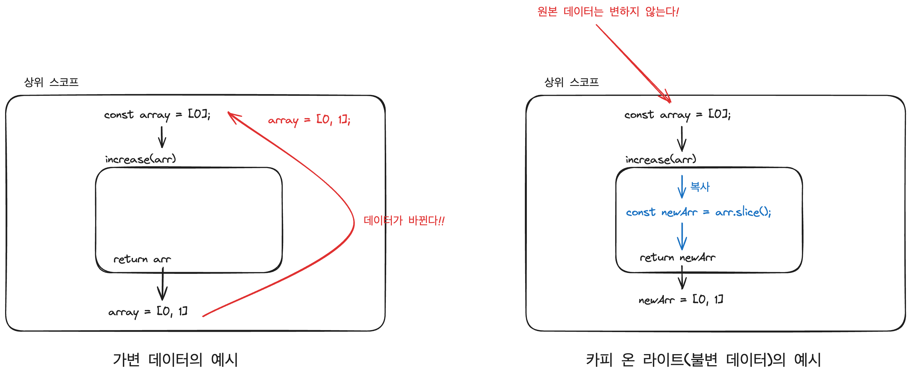
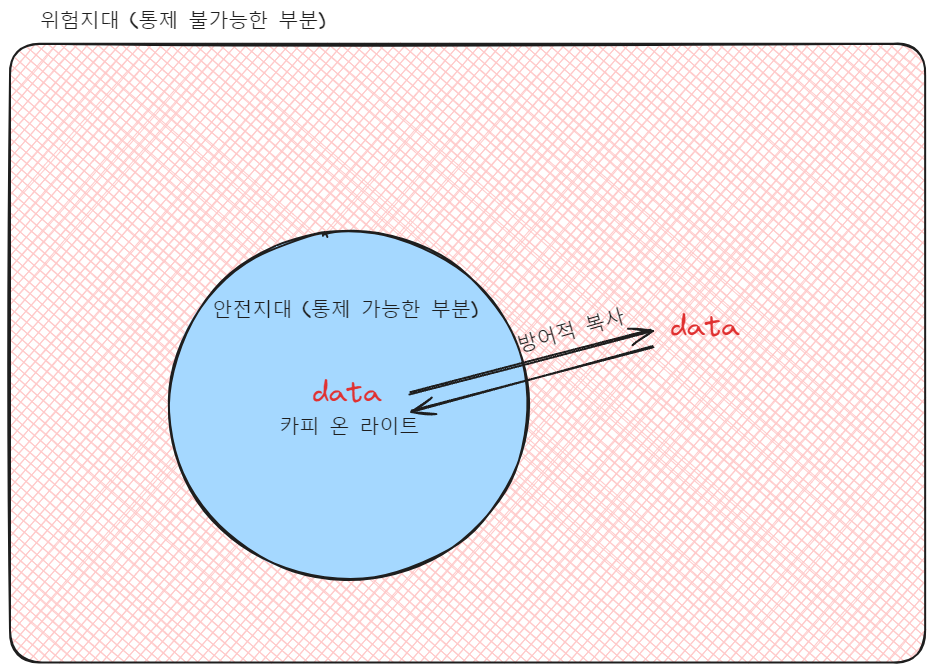
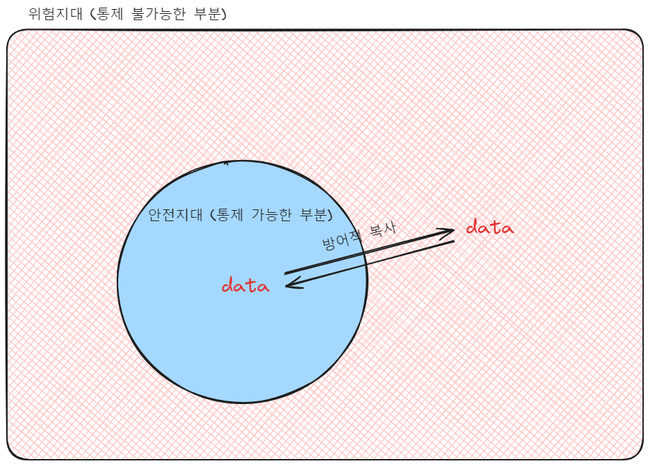

1편을 안보고 오셨다면 이전 글을 읽고 오시는걸 추천드립니다.
[함수형 프로그래밍 발만 담가보기 (1) - '데이터, 계산, 액션'](https://stu442.github.io/%ED%95%A8%EC%88%98%ED%98%95-%ED%94%84%EB%A1%9C%EA%B7%B8%EB%9E%98%EB%B0%8D-%EB%B0%9C%EB%A7%8C-%EB%8B%B4%EA%B0%80%EB%B3%B4%EA%B8%B0-1-%EB%8D%B0%EC%9D%B4%ED%84%B0-%EA%B3%84%EC%82%B0-%EC%95%A1%EC%85%98/)
## 다시, 함수형 프로그래밍이란?

저번 글에서, 함수형 프로그래밍은

> 1. 자료 처리를 계산으로 취급하고
> 2. 가변 데이터를 멀리하는
> 3. 프로그래밍 패러다임의 하나이다.

라고, 이야기했습니다.

이번 글에서는 '가변 데이터'를 멀리하는 게 도대체 무엇이고, 왜 그러는 것인지 알아보겠습니다.
## 데이터 불변성을 유지하자.

"가변 데이터를 멀리하자!"는 결국 "데이터가 '**불변**'해야 한다"를 의미합니다.
데이터가 변하지 않는 것은 코드의 복잡성을 줄이고, 예측 가능성을 높여줍니다.

`계산`은 언제 어떻게 실행하든 함수 외부에 영향을 주지 않습니다. 
같은 입력에 항상 같은 출력을 반환합니다.
이런 계산의 특징은 마찬가지로 부수효과를 줄여 코드의 복잡성을 줄이고, 예측 가능성을 높여줍니다.

그러나 *만약 데이터가 변한다면 그 함수는 더 이상 `계산`이 아니고, 부수효과를 일으키는 `액션`이 됩니다.*

```js
var a = 1;

function add() {
	a++
	console.log(a)
}

add(); // 출력: 2
add(); // 출력: 3
add(); // 출력: 4
add(); // 출력: 5
add(); // 출력: 6
add(); // 출력: 7
add(); // 출력: 8
add(); // 출력: 9
add(); // 출력: 10

```
(위 코드는 함수를 호출할 때마다 데이터가 변하니 `액션`이네요!!)

그렇기에 우리는 `데이터 불변성`을 지켜야 하는 것입니다.

이 책에서는 데이터 불변성을 지키기 위한 방법으로 2가지 개념을 소개합니다.

1. 카피 온 라이트 (Copy on Write)
2. 방어적 복사
### 카피 온 라이트(Copy on Write)

카피 온 라이트는 데이터를 조작하기 전에, 원본을 직접 수정하지 않고 `복사본`을 만들고 조작하는 것을 의미합니다.

예를 통해 좀 더 쉽게 알 수 있습니다.

```js
const array = [0]

function increase(arr) {
  const temp = arr[arr.length - 1];
  arr.push(temp + 1);
  return arr
}

console.log(increase(array))
// 출력 : [0, 1]
console.log(increase(array))
// 출력 : [0, 1, 2]
console.log(increase(array))
// 출력 : [0, 1, 2, 3]
console.log(increase(array))
// 출력 : [0, 1, 2, 3, 4]
console.log(array)
// 출력 : [0, 1, 2, 3, 4]
// 원본 배열값이 바뀐다.
```

위 `increase` 함수는 실행할 때마다 원본 배열을 바꾸게 됩니다.
이는 외부 세계에 영향을 끼치는 행위이기에 `액션`이 됩니다.

액션은 멀리하는 게 좋을 것 같은데... 어떻게 바꿔야 할까요??

```js 
function increaseFn(arr) {
  const newArr = arr.slice();
  const temp = arr[arr.length - 1];
  newArr.push(temp + 1)
  return newArr
}

console.log(increaseFn(array));
// 출력 : [0, 1]
console.log(increaseFn(array));
// 출력 : [0, 1]
console.log(increaseFn(array));
// 출력 : [0, 1]
console.log(array);
// 출력 : [0]
// 원본 배열의 값은 바뀌지 않는다.
```

`increaseFn` 함수는 같은 동작을 수행합니다. 그렇지만 원본 배열의 값은 몇 번을 실행해도 바뀌지 않습니다. 즉, 외부 세계에 영향을 주지 않습니다.
이 함수는 `계산`입니다.

`increase` 함수에서 arr 값을 *복사하는 로직*만 추가했을 뿐인데, `계산`이 되었습니다.

이것이 "카피 온 라이트"입니다.

그림으로 간단하게 표현해 봤습니다.



### 방어적 복사

카피 온 라이트는 "*우리가 수정할 수 있는 코드 안*"에서 데이터를 주고받습니다.
하지만, 방어적 복사는 "*신뢰할 수 없는 코드*"와 "*데이터*"를 주고받을 때 **복사본**을 만들어 전달하는 방식을 말합니다.

`카피 온 라이트`와 `방어적 복사`는 그 개념이 매우 비슷하지만, 굉장히 다른 기술입니다.
#### 안전지대



`카피 온 라이트`는 안전지대 안에서 사용합니다.
`방어적 복사`는 안전지대 밖에 접근할 때 사용합니다.

"접근"에 대한 개념은 방어적 복사를 사용하는 "두 가지 상황"에서 더 설명할 예정이니, 우선 안전지대에 대한 개념만 설명하겠습니다.

안전지대는 통제할 수 있는 영역입니다.
제가 코드를 직접 수정할 수 있죠.

```js
function increaseFn(arr) {
  const newArr = arr.slice();
  const temp = arr[arr.length - 1];
  newArr.push(temp + 1)
  return newArr
}
```

예를 들어 이 코드는 안전지대입니다.
확실하게 통제 가능하고, 변경할 수 있는 코드입니다.

그렇지만 당장 고칠 수 없는 '*레거시 코드*' 라던가 *라이브러리의 특정 함수*를 사용한다면 통제가 불가능한 안전 지대 밖, '위험지대' 인 거죠.
#### 깊은 복사

`카피 온 라이트`는 *얕은 복사*를 사용합니다.
`방어적 복사`는 *깊은 복사*를 사용합니다.

깊은 복사는 얕은 복사보다 상대적으로 많은 리소스를 요구하는 작업으로 신중히 써야 합니다.

이제 '방어적 복사를 사용해야 하는 두 가지 상황'에 대해 알아보겠습니다.
앞으로 이 두 가지 상황이 아니면 되도록 방어적 복사는 사용하지 않습니다.
#### 두 가지 상황



1. 데이터가 안전지대에 들어올 때
2. 데이터가 안전지대에서 나갈 때

이 두 가지 상황이 아니라면 `방어적 복사`의 사용을 지양해야 합니다.
#### 방어적 복사를 사용해 보자.

```js
// 당장 고칠 수 없는 유틸 함수 (액션)
import someUtil from '/utils'

const obj = {
	// 대충 데이터
}

// 이 함수는 계산인가??
function someCal(obj) {
	someUtil(obj);
	// obj는 불변인가??
	return obj
}
```

`someCal` 함수는 `someUtil` 이라는 `액션` 때문에 또 다른 액션이 되어 버립니다.
액션은 전염되기 때문이죠.

**전염**이라는 키워드에 주목해 봅시다!, `someUtil` 함수는 당장 고칠 수는 없는 함수이고, `액션`입니다.
`액션`인 `someUtil` 함수는 외부에 영향을 줄 수 있기 때문에 실행 시점에 따라 반환 값이 달라질 수 있습니다.
때문에 `someUtil`를 호출할 때 쓰인 인자 `obj`도 불변 데이터일지 알 수 없는 상황입니다.

이렇게 `someCal`는 액션이 됩니다.
이런 현상을 두고 저희는 '액션은 전염된다'라고 표현합니다.

당장 수정이 어려운 함수에 대한 전염을 막기 위한 대책으로 `방어적 복사`를 사용합니다.

```js
// 당장 고칠 수 없는 유틸 함수 (액선)
import someUtil from '/utils'

const obj = {
	// 대충 데이터
}

// 원본 데이터(obj)가 변경 되었는가?
// 이 함수는 계산인가?
const someCal(obj) 
	// deepCopy() 는 깊은 복사를 위한 함수
	const copyObj = deepCopy(obj);
	someUtil(copyObj)
	return copyObj
}
```

이 경우 `someCal`은 계산입니다.
외부에 영향을 주지 않고(obj는 변경되지 않는다.), 어떤 시점에 실행하든 같은 입력(obj)에 같은 결과(copyObj)를 반환하기 때문이죠.
### 정리

지금까지 내용을 정리하면 아래와 같습니다.

> 함수형 프로그래밍에서는 `카피 앤 라이트`와 `방어적 복사`를 이용해 `데이터 불변성`을 유지하려 노력하고, 이는 함수를 예측 가능하고 부수효과가 적은 `계산`으로 만들어 줍니다.
### 깊은 복사 사용

추가로 실제로 적용해 보고 싶은 분들을 위해 작은 팁을 넣어뒀습니다.

깊은 복사를 사용하는 방법은 몇 가지가 있습니다.

1. Lodash 라이브러리의 `.cloneDeep()` 함수를 사용합니다.
2. 최근 추가된 `structuredClone()` API를 사용합니다.
	1. IE에서는 지원하지 않는 API이므로, 필요할 경우에는 폴리필을 사용할 수 있습니다.
3. `JSON.parse(JSON.stringify(obj))`


자세한 방법은 구글에 검색하면 많이 나오니 참고하시면 되겠습니다!!
~~귀찮은 게 아닙니다~~
## 더 다양한 기술

계속해서 언급했듯, 이 글은 ['쏙쏙 들어오는 함수형 코딩'](https://product.kyobobook.co.kr/detail/S000001952246) 을 읽고 공유하고 싶은 마음에 쓴 글입니다. 위 책에서 이야기하는 내용의 1/10도 담고 있지 않습니다. 제 글을 읽고 함수형 코딩에 흥미가 생기게 된다면 꼭 한번 책으로 읽어보길 강력히 추천합니다!!

(지금 1편과 2편 사이에도 액션에서 계산을 빼내는 여러 가지 기술이나, 액션을 더 낫게 하는 방법 등 유용한 정보들이 빠졌습니다.)
(빠진 내용들을 간단하게 공부해 보고 싶다면 [테오 님의 게시글](https://velog.io/@teo/functional-programming-study)을 추천합니다.)